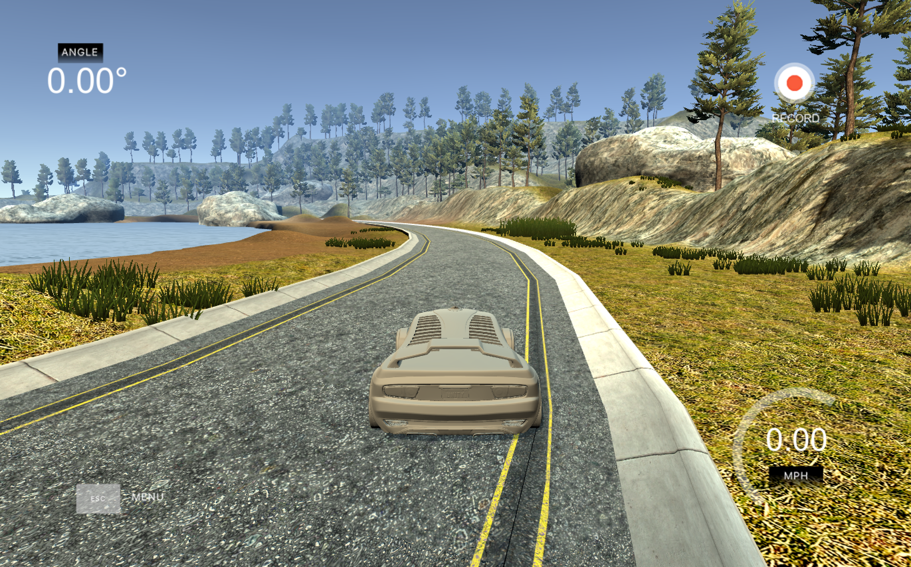
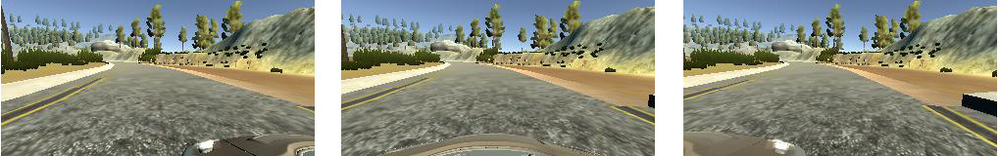

#**Behavioral Cloning Writeup** 


**Behavrioal Cloning Project**

The goals / steps of this project are the following:
* Use the simulator to collect data of good driving behavior
* Build, a convolution neural network in Keras that predicts steering angles from images
* Train and validate the model with a training and validation set
* Test that the model successfully drives around track one without leaving the road
* Summarize the results with a written report


### My project includes the following files:

* model.py containing the script to create and train the model
* drive.py for driving the car in autonomous mode
* model.h5 containing a trained convolution neural network 
* writeup_report.md or writeup_report.pdf summarizing the results

Using the Udacity provided simulator and my drive.py file, the car can be driven autonomously around the track by executing 
```sh
python drive.py model.h5
```

The model.py file contains the code for training and saving the convolution neural network. The file shows the pipeline I used for training and validating the model, and it contains comments to explain how the code works.

### Model Architecture and Training Strategy

####1. An appropriate model arcthiecture has been employed

The final network is borrowed from Nvidia's CNN for Self-driving car. ([Click for details.](https://images.nvidia.com/content/tegra/automotive/images/2016/solutions/pdf/end-to-end-dl-using-px.pdf "Click for details."))
The original architecture is shown in the following figure. 


I made a little change to the original Nvidia CNN. I add a cropping layer after the normalization layer. 
The network consists of 10 layers, including a normalization layer, a cropping layer, 5 convolutional layers and 3 fully connected layers.  (model.py line 60-72).

The first layer of the network performs image normalization. The normalizer is hard-coded and is not adjusted in the learning process. Performing normalization in the network allows the normalization scheme to be altered with the network architecture and to be accelerated via GPU processing.

The second layer of the network is the cropping layer. It cropped 50 pixels from the top and 20 pixels from the botton of the imput images. 

The convolutional layers were designed to perform feature extraction. It uses strided convolutions in the first three convolutional layers with a 2×2 stride and a 5×5 kernel and a non-strided convolution with a 3×3 kernel size in the last two convolutional layers.

The five convolutional layers follow with three fully connected layers leading to an output control value which is the inverse turning radius. The fully connected layers are designed to function as a controller for steering.

####2. Attempts to reduce overfitting in the model

The model was trained and validated on different data sets to ensure that the model was not overfitting (model.py line 77). The model was tested by running it through the simulator and ensuring that the vehicle could stay on the track.

####3. Model parameter tuning

The model used an adam optimizer, so the learning rate was not tuned manually (model.py line 76).

####4. Appropriate training data

Training data was chosen to keep the vehicle driving on the road. I used a combination of center lane driving, recovering from the left and right sides of the road. I also flip the image left-to-right, therefore, we have same amount of left and right turn training samples(model.py line 36-42).

For details about how I created the training data, see the next section. 

###Model Architecture and Training Strategy

####1. Solution Design Approach

My first step was to use a convolution neural network model similar to the classical LeNet. The only thing I need to change is the input size from 32x32x3 to 160x320x3. Then I change the output layer from 10 to 1. 
I thought this model might be appropriate because the LeNet is a very power network, which has a very good performance in the Project 2 (traffic sign classification).

In order to gauge how well the model was working, I split my image and steering angle data into a training and validation set. I found that my first model had a high mean squared error on both the training set and the validation set.
This implied that the model was underfitting.  It also cannot make the car drive well in the autonomous model. 

I think I may need to try some better and deeper network. I search online find that the Nvidia has developed a CNN for Self-driving Car. Why not have a try?

Then I change NetWork to the 9-layer network. I also add a normalization layer to reduce the error. It does helps a lot. 

After I trained the model, I found that the car only turns left. I think the reason is that in track one, almost all the turns are left turn. In order to have the traing samples for right turn, I flip all the sample images and the sterring measurements.  (model.py line 36-42)

Also in order to make the training faster, I crop the input images. I add a cropping layer in after the normalization layer. It cropped 50 pixels from the top and 20 pixels from the botton of the imput images.  (model.py line 62)

The final step was to run the simulator to see how well the car was driving around track one. There were a few spots where the vehicle fell off the track, especially at the turns. To improve the driving behavior in these cases, I record more training datas in these spots. 

At the end of the process, the vehicle is able to drive autonomously around the track without leaving the road.

####2. Final Model Architecture

The final model architecture (model.py lines 60-72) consisted of a convolution neural network with the following layers and layer sizes.

```
model = Sequential()
model.add(Lambda(lambda x: x/255.0 - 0.5, input_shape = (160, 320, 3)))
model.add(Cropping2D(cropping=((50,20),(0,0))))
model.add(Convolution2D(24,5,5, subsample=(2,2), activation='relu'))
model.add(Convolution2D(36,5,5, subsample=(2,2), activation='relu'))
model.add(Convolution2D(48,5,5, subsample=(2,2), activation='relu'))
model.add(Convolution2D(64,3,3, activation='relu'))
model.add(Convolution2D(64,3,3, activation='relu'))
model.add(Flatten())
model.add(Dense(100))
model.add(Dense(50))
model.add(Dense(10))
model.add(Dense(1))
```

####3. Creation of the Training Set & Training Process

To capture good driving behavior, I first recorded more than one laps on track one using center lane driving. Here is an example image of center lane driving:


I then recorded the vehicle recovering from the left side and right sides of the road back to center so that the vehicle would learn to go back to the center of the road from the edges of the road. The following image shows the recovery from the right edge to the center:



To augment the data sat, I also flipped images and angles thinking that this would solve the left turn bias problem. For example, here is an image that has then been flipped:


I also crop the images in order to make the training faster. 

Original image taken from the simulator


Cropped image after passing through a Cropping2D layer


I also use multiple cameras inputs in this project.  When recording, the simulator will simultaneously save an image for the left, center and right cameras. Each row of the csv log file, driving_log.csv, contains the file path for each camera. In this case, we can teach our model how to steer if the car drifts off to the left or the right.



After the collection process, I had 25056 number of data points. 

I finally randomly shuffled the data set and put 20% of the data into a validation set. (model.py line 77)

I used this training data for training the model. The validation set helped determine if the model was over or under fitting. The ideal number of epochs was 5, since after 5 epoches, the validation error will never decrease. The batch size I choose is 128. I used an adam optimizer so that manually training the learning rate wasn't necessary.
